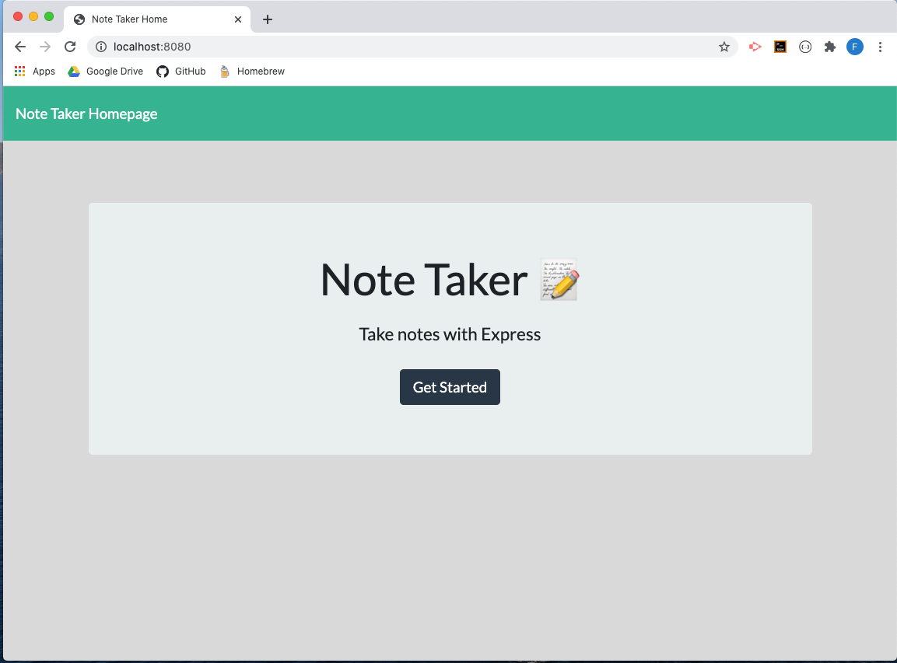
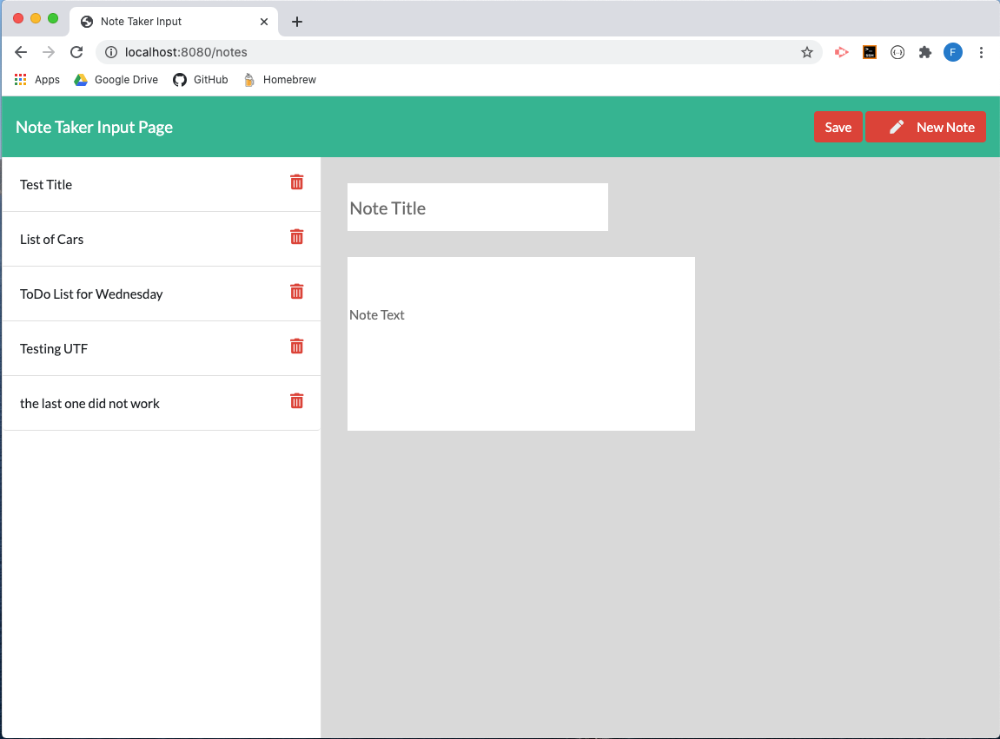
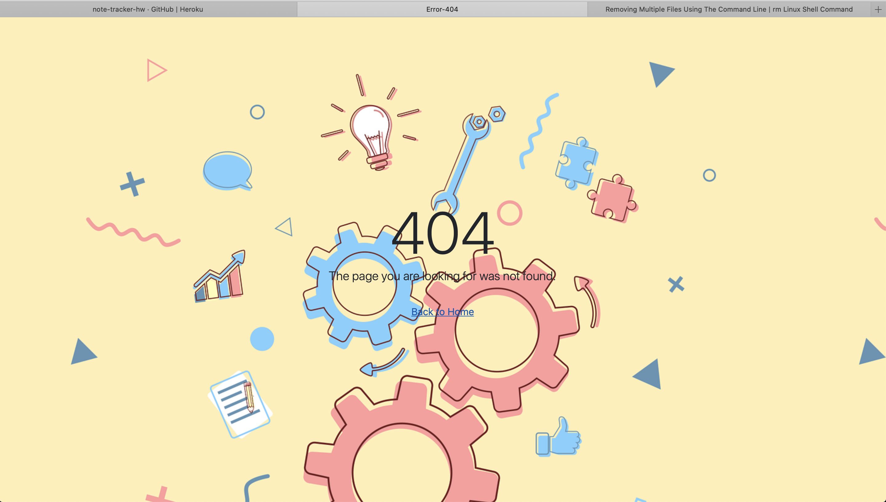

# Team-Engine-Template

   
    
## Description
Create an application that can be used to write, save, and delete notes. This application will use an express backend and save and retrieve note data from a JSON file.

## Table of Content
- [usage](#usage)
- [licenses](#licenses)
- [contribution](#contribution)
- [test](#test)
- [email](#email)
   
### usage: 
  - This application will be used to generate a fully custom file with the information of specific team members as requested by the user. All the required information will be ingested via the app.js file. All other processes are automatic and happen in the background.
 
### licenses: 
  - MIT
    
### contribution: 
  - Developer
    
### test: 
  - To test this application you need to clone the repo.
  - Run server.js file in terminal via node server.js
  - From homepage, click "Get Started" which will take you to the input page. 

  

  - In input page, you can add a new note by adding a title and text.
  - Next step is to save the note and request a new note template.
  - The saved note can be seen on the sidebar once the user refreshes the page.

  

  - A completed process would be to delete the note on the sidebar by using the trashcan icon.
  - Finally, a wrong LocalHost URL address will respond with a 404 page.

  
    
### email: 
  - bpr59@comcast.net

### inquires:
For question about this project, please contact the developer via Github username: bpr59 or by email bpr59@comcast.net 

